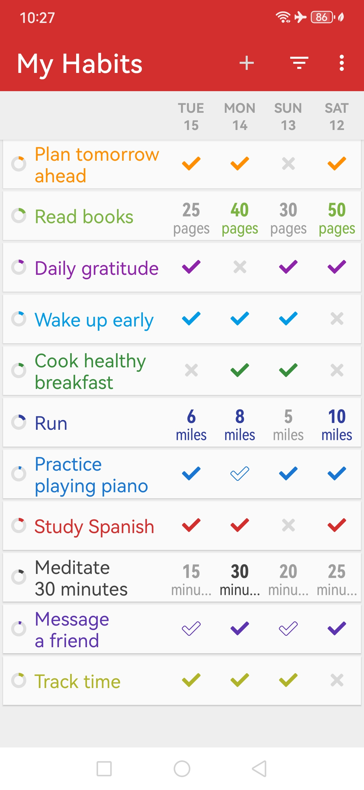
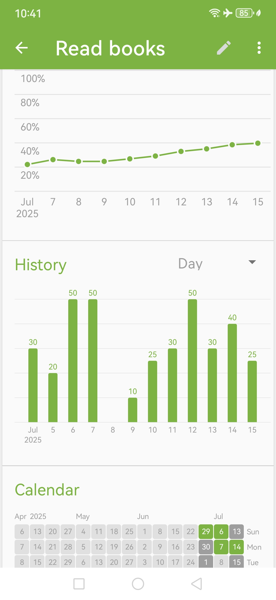
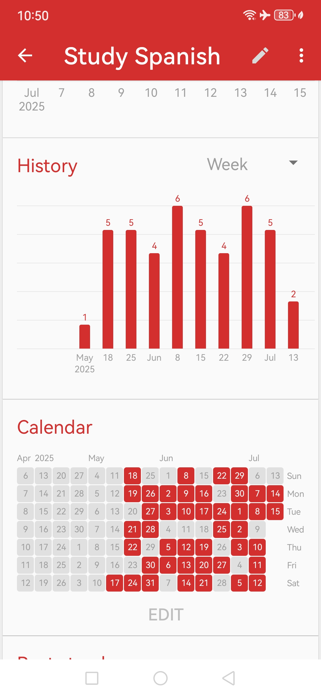
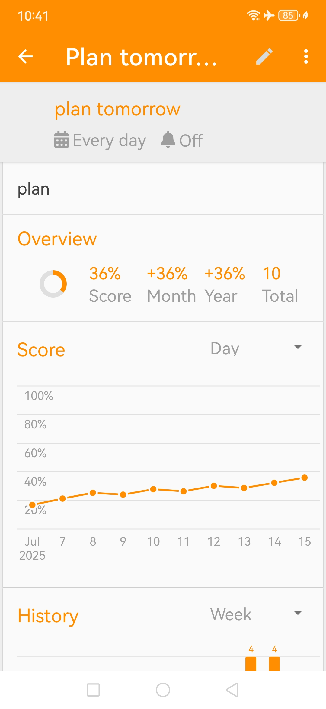
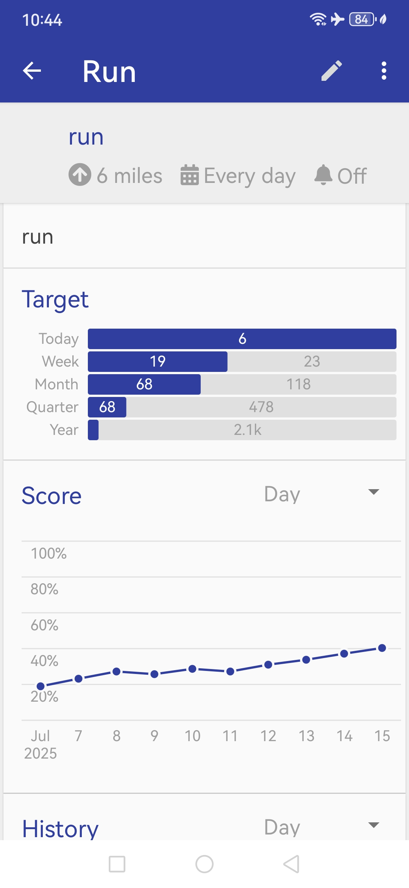
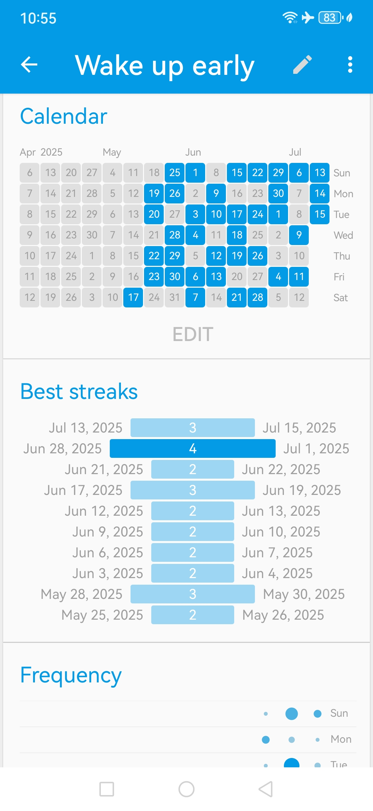

<h1 align="center">My Habits</h1>

> ⚠️ **This project is a modified version of the open-source app [Loop Habit Tracker](https://github.com/iSoron/uhabits), originally created by Álinson Santos Xavier (<isoron@gmail.com>).  
It is redistributed under the same GNU GPLv3 license, with branding and adjustments maintained by [AnkaraTurkey](https://github.com/ankaraturkey).**

**My Habits** is a mobile app that helps you build and maintain long-term positive habits. It features a clean interface, detailed graphs, flexible schedules, and complete offline privacy — all 100% open source and ad-free.

---

## 🧩 Features

- **Minimalist interface** – Smooth, distraction-free experience
- **Flexible schedules** – Support for daily, weekly, custom habits
- **Reminders** – Smart notifications for each habit
- **Widgets** – Add habits to your home screen
- **Detailed stats** – Track strength, streaks, completion
- **No limits** – Unlimited habits, free for everyone
- **Private by default** – Offline-first, no login required
- **Data export** – CSV/SQLite support
- **Fully open source** – No ads, no hidden features

---

## 📸 Screenshots

---

## 📲 Installing

The easiest way to install **My Habits** is from the [Google Play Store](https://play.google.com/store/apps/details?id=com.dodo.dohabits).

You can also [download the APK manually from Releases](https://github.com/ankaraturkey/myHabits/releases), or [build from source](https://github.com/iSoron/uhabits/blob/dev/docs/BUILD.md).

---

## 🤝 Contributing

We welcome contributions! You can:

- ✍️ [Report bugs or request features](https://github.com/ankaraturkey/myHabits/issues)
- 🌐 Help with translations via [Loop's open translation project](https://translate.loophabits.org)
- 📣 Share the app and leave a rating on Google Play
- 👨‍💻 Fork and contribute code (see [guidelines](https://github.com/iSoron/uhabits/blob/dev/docs/GUIDELINES.md))

---

## 🛡 License

**My Habits** is free software, licensed under the [GNU General Public License v3](https://www.gnu.org/licenses/gpl-3.0.html).  

It is a fork of [Loop Habit Tracker](https://github.com/iSoron/uhabits), developed by  
**Álinson Santos Xavier <isoron@gmail.com>**, and redistributed with modifications by:  
**AnkaraTurkey <ankanaturkey@outlook.com>**, 2024.

All original rights and attribution are retained, and all code remains fully open source under the same license.

👉 *You may use, modify, and distribute this app freely under the terms of the GPLv3 license.*

---

## 🙏 Acknowledgments

- 💙 Thanks to [Álinson Santos Xavier](https://github.com/iSoron) for creating the original app
- 📢 Thanks to all contributors, translators, and users who make habit tracking better

---

## 🔗 Useful Links

- [Original Project (uhabits)](https://github.com/iSoron/uhabits)
- [License (GPLv3)](https://www.gnu.org/licenses/gpl-3.0.en.html)
- [How to build the app](https://github.com/iSoron/uhabits/blob/dev/docs/BUILD.md)

---

[screen1]: screenshots/1.png  
[screen2]: screenshots/2.png  
[screen3]: screenshots/3.png  
[screen4]: screenshots/4.png  
[screen5]: screenshots/5.png  
[screen6]: screenshots/6.png  
[screen1th]: screenshots/1.thumb.png  
[screen2th]: screenshots/2.thumb.png  
[screen3th]: screenshots/3.thumb.png  
[screen4th]: screenshots/4.thumb.png  
[screen5th]: screenshots/5.thumb.png  
[screen6th]: screenshots/6.thumb.png  
